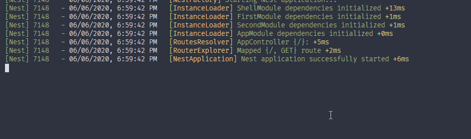
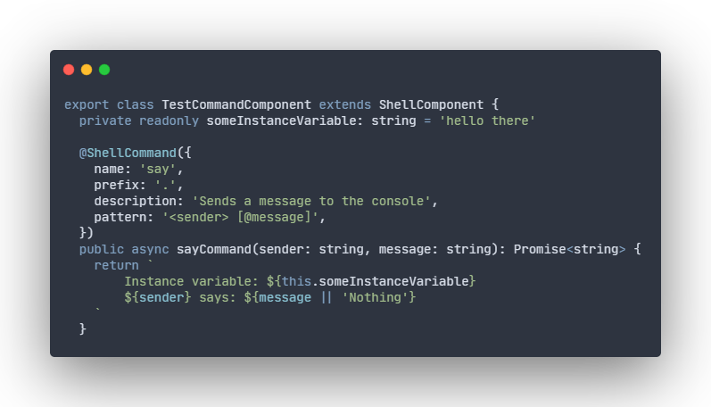

<div style="text-align: center">
  <h1>NestJS Shell</h1>
  
  <br />
  <a href="#"></a>  
  &mdash;  
  <a href="#"></a>  
  &mdash;  
  <a href="#"></a>  
</div>
<br />

## Description
I wanted to create as simple as possible API without redundant use cases. Which you allow to create simple a command in less than a minute (counting installation time).
Currently, there are a few libraries that provide something similar to this, but they violate your app's execution file with their code and require you to re-run the app's instance every time you want to execute a command.   
So I decided to give you full control of where and when shell's instance should start and a way to execute commands in runtime.

For more examples, go there: https://github.com/bmstefanski/nestjs-shell-example

## Features

   
     
- [x] 🙉 Non-blocking runtime console 
- [x] 🚚 No dependencies
- [x] 🤠 Simple and stable API
- [x] 🛡️ Well tested
- [x] 🖥️ Modifiable error messages and prompt sign
- [x] 🖨️ Elastic output printer (you can write own printer or use any logger you want)
- [x] 📔 Optional, required and varargs parameters
- [ ] Travis or GitHub Actions based CI

## Installation

```
# production use
$ yarn add nestjs-shell

# development use
$ yarn add -D nestjs-shell
```

## Usage

##### Execution and registration
```typescript
import { ShellFacade } from 'nestjs-shell'

// `ShellModule` is Global, so please put it only in your main module and it will work perfectly in others.
@Module({ imports: [ShellModule] })
export class YourAppMainModule implements OnApplicationBootstrap {
  constructor(private readonly shellFacade: ShellFacade) {}

  public async onApplicationBootstrap(): Promise<void> {
    // `ShellModule` is Global, so please put it only in your main module and it will work flawlessly in others. You can use it without passing any arguments and use default configuration or configure it in your own way (table below)
    await this.shellFacade.bootstrap()

    // It does not have to be here, you can use this method anywhere you want and as many times as you need. 
    this.shellFacade.registerComponents(
      new TestCommandComponent(), 
      new AnotherSecondTestCommandComponent(new SomeDependency()),
    )
  }
}
```

##### Simple example with required, optional and varargs parameters
```typescript
import { ShellCommand, ShellComponent } from 'nestjs-shell'

// Please do not put @Injectable() or any other decorator that creates a new instance of the class, it may cause bugs and it is definitely not going to work the way you want. 
export class SayCommandComponent extends ShellComponent {

  // Only `name` property is required, so by default you have no prefix, no description and no pattern and it works fine!
  /* Pattern ideology is simple:
      if your parameter name is wrapped with `<` and `>` then it's required
      if your parameter name is wrapped with `[` and `]` then it's optional
      if there is `@` sign inside any brackets (`[` or `<`) then it's varargs. Same as in JavaScript varargs, they need to be placed as a last parameter.
  */
  @ShellCommand({
    name: 'say',
    prefix: '.',
    description: 'Sends a message to the console',
    pattern: '<sender> [@message]',
  })
  public async sayCommand(sender: string, message: string): Promise<string> {
    return `${sender} says: ${message || 'Nothing'}`
  }

  // There is no limit to the amount of commands in one ShellComponent.
  @ShellCommand({
    name: 'said',
    prefix: '/',
    description: 'Sends a message to the console that has been said',
    pattern: '<sender> <@message>',
  })
  // You don't have to keep function's parameters in the same order as pattern ones. They are applied by name, not order.
  public async saidCommand(sender: string, message: string): Promise<string> {
    return `${sender} said: ${message}`
  }
}
```


##### Constructor dependencies 
```typescript
import { ShellCommand, ShellComponent } from 'nestjs-shell'

export class AnotherSecondTestCommandComponent extends ShellComponent {
  constructor(private readonly someDependency: TestDependency) {
    super()
  }

  // You can use as much prefixes as you want.. if you do not specify any then it uses default, which is '' (empty string)
  @ShellCommand({
    name: '.help',
    description: 'Displays all commands with description and usage',
  })
  public async help(): Promise<string> {
    // Method's execution context is ALWAYS set to the actual class instance and so `this` keyword works as expected.
    return [
      'Here are all available commands: ',
      '-------------------------------------',
      ...this.someDependency,
      ...this.shellFacade.getAllCommands().map((command) => {
        return `-> ${command.name} ${command.pattern} - ${command.description || 'Description not available'}`
      }),
      '-------------------------------------',
    ].join('\n')
  }
}
```

## API specification
The library shares its methods through the facade, named `ShellFacade`. In the table below, you can see a brief description of each method.
```typescript
import { ShellFacade } from 'nestjs-shell'
```


| Method               |                             Description                              |             Arguments             |
| :------------------- | :------------------------------------------------------------------: | :-------------------------------: |
| `bootstrap`          |                           Enables terminal                           |        `BootstrapOptions`         |
| `registerComponents` |               Adds command components to the registry                | `...components: ShellComponent[]` |
| `getAllCommands`     | Returns immutable (or to be more precise: deep copy of a collection) |              naught               |

```typescript
type BootstrapOptions = {
  prompt?: string = '⤳'
  messages?: { notFound?: string; wrongUsage?: string } = { 
    notFound: 'Say what? I might have heard $input',
    wrongUsage: 'Wrong usage: $command $pattern',
  }
  shellPrinter?: ((value: any) => void) = (value: any) => console.log(value)
}
```

## Contributions and license

> **Note:** If you want to contribute, please keep in mind that I don't want to support various use cases, it should remain as simple as it is. So if you desire to improve code rather than add features, then I would greatly appreciate it 🙏🙏🏻🙏🏼🙏🏽🙏🏾🙏🏿.

Nestjs-shell is [MIT licensed](LICENSE)

